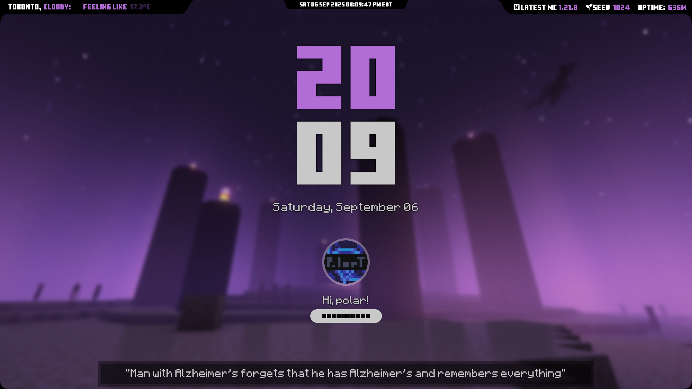

# PolarT's End Hyprlock Lockscreen

My clean (I think) Hyprlock setup I made a while back with a Minecraft End theme. I decided to upload it on github since well I think its the only place people won't complain about it being a "Virus".

There are **two versions** of this rice:

| Version | Resolution |
|--------|------------|
| Desktop | 2560x1440
| Laptop | 1920x1080

They're basically the same but scaled differently (duh)
If you need a **different resolution** for either Desktop/Laptop, you'll have to tweak it yourself (I'm lazy zzz).

---

## Preview



---

## Customization

You can add/remove lines in the `hints.txt` file to customize random quotes displayed in the bottom of the screen.

Edit the `./scripts/update_weather.sh` script to change your City location. (**WARNING: It DOES SHOW your city in the lockscreen!**)

Of course, you can edit the `hyprlock.conf` file for more advanced customizations, but I'm warnin ya, it's **PURE SPAGHETTI CODE!!**

---

## Installation

Clone the repo:

```bash
git clone https://github.com/PolarT-py/endhyprlock.git
cd endhyprlock
```

